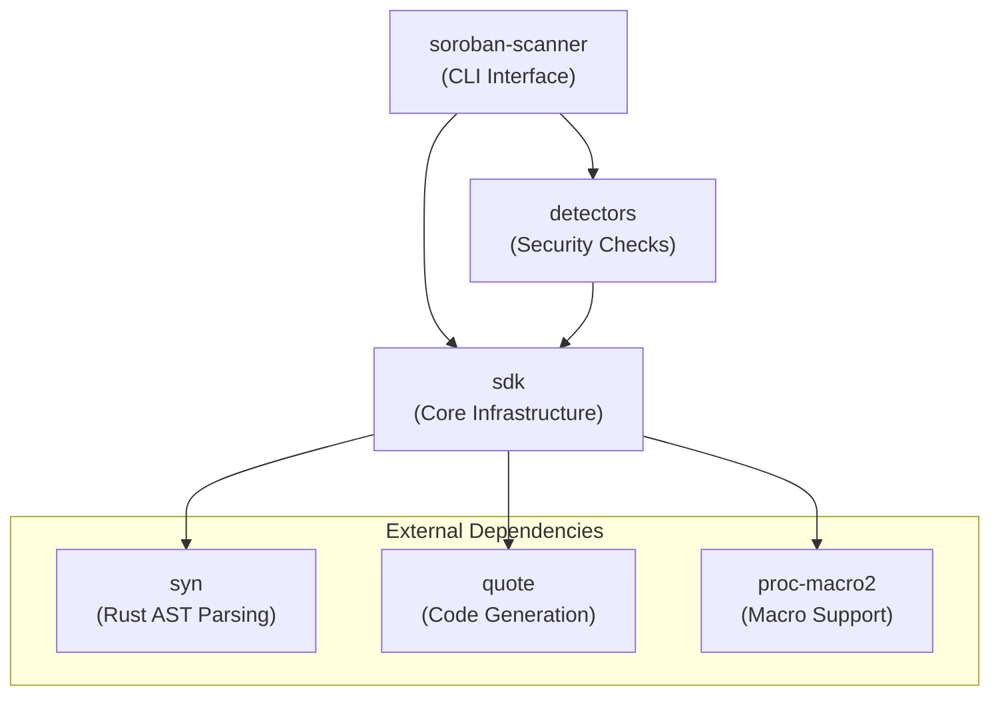
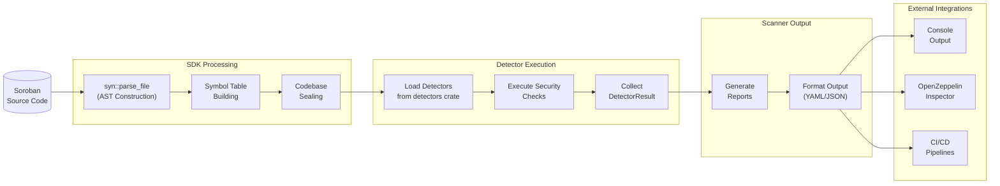
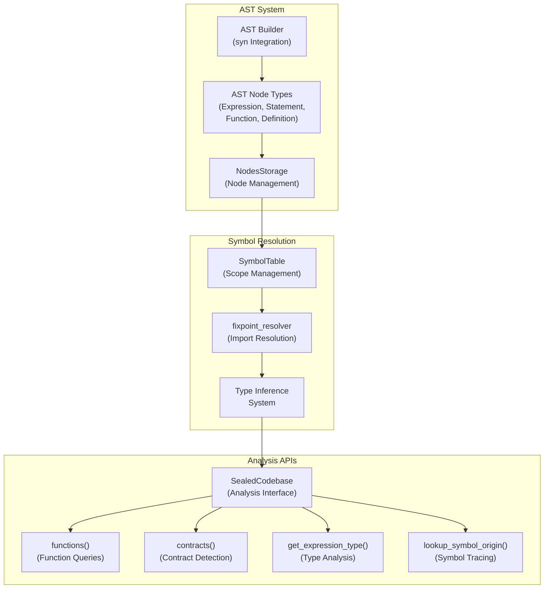
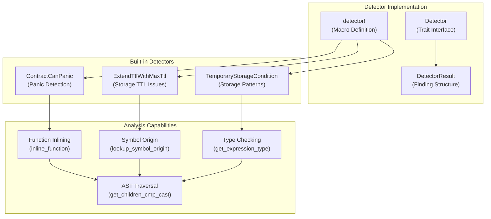
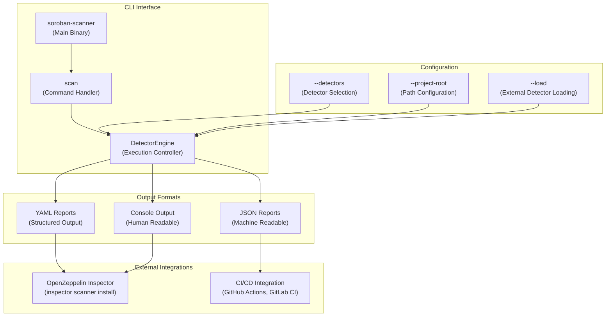

# Overview

## Purpose and Scope

This document provides a comprehensive introduction to the Soroban Security Detectors SDK, a static analysis framework
designed specifically for detecting security vulnerabilities in Soroban smart contracts. The framework enables
developers to identify potential security issues in Stellar smart contracts written in Rust through sophisticated AST
parsing, symbol resolution, and configurable security detectors.

This overview covers the system's architecture, core components, and integration capabilities. For detailed information
about the AST system implementation, see [AST System](3_AST_System.md). For guidance on creating custom detectors,
see [Security Detectors](7_Security_Detectors.md). For CLI usage instructions, see [CLI Scanner](8_CLI_Scanner.md).

## Three-Crate Architecture

The Soroban Security Detectors SDK follows a modular three-crate architecture that separates concerns and enables
extensibility:

| Crate             | Purpose                          | Key Components                                     |
|-------------------|----------------------------------|----------------------------------------------------|
| `sdk`             | Core analysis infrastructure     | AST parsing, symbol tables, analysis utilities     |
| `detectors`       | Security vulnerability detection | Prebuilt detectors, detector metadata              |
| `soroban-scanner` | Command-line interface           | CLI tool, report generation, external integrations |

### Crate Dependencies

**Crate Dependency Architecture**

## System Workflow

The framework processes Soroban smart contracts through a systematic pipeline from source code to security reports:

**End-to-End Security Analysis Workflow**

## Core Components

### SDK Infrastructure

The `sdk` crate provides the foundational components for static analysis:

**SDK Core Component Architecture**

### Detector Framework

The `detectors` crate implements security vulnerability detection using the SDK infrastructure:

**Detector Framework Components**

### Scanner Interface

The `soroban-scanner` crate provides command-line access and external integrations:

**Scanner CLI and Integration Architecture**

## Integration Capabilities

### OpenZeppelin Inspector Compatibility

The framework provides full compatibility with OpenZeppelin Inspector's custom scanner interface, enabling seamless
integration into existing security workflows. The `soroban-scanner` binary can be installed directly as an Inspector
custom scanner and provides metadata and findings in the expected format.

### CI/CD Pipeline Integration

The scanner is designed for automated security analysis in continuous integration environments. It provides structured
output formats and configurable exit codes for pipeline integration, supporting both GitHub Actions and GitLab CI
workflows.

### Extensibility Framework

The modular architecture allows developers to create custom detectors by leveraging the SDK's AST parsing, symbol
resolution, and analysis utilities. The `detector!` macro simplifies detector implementation while providing access to
sophisticated analysis capabilities.