# System Architecture

This document describes the high-level architecture of the Soroban Security Detectors SDK, covering the data flow from
source code to security reports and the interactions between core components. The system consists of three main crates
that work together to provide comprehensive security analysis for Soroban smart contracts.

For information about specific AST node types and their structure, see [AST Node Types](4_AST_Node_Types.md). For
details on symbol resolution and type inference mechanisms,
see [Symbol Table and Analysis](5_Symbol_Table_and_Analysis.md). For guidance on creating custom detectors,
see [Security Detectors](7_Security_Detectors.md).

## Three-Crate Architecture

The system is organized as three distinct but interconnected crates, each serving a specific purpose in the security
analysis pipeline:

**SDK Crate**: Provides the foundational code analysis infrastructure including AST parsing, symbol table management,
and codebase representation. This crate defines the `Codebase<S>` type and related analysis APIs.

**Detectors Crate**: Contains implementations of specific security detectors that analyze codebases for vulnerabilities.
Each detector uses the `detector!` macro and implements pattern matching against the AST.

**Scanner Crate**: Provides the command-line interface and orchestrates the execution of detectors against target
codebases, generating formatted reports for various output formats.

## Data Flow Pipeline

The system processes Soroban smart contracts through a sophisticated pipeline that transforms source code into
actionable security reports:

```mermaid
flowchart TD
    INPUT["Source Files<br/>(Rust/Soroban Code)"]
    PARSE["syn::parse_file<br/>Raw AST Generation"]
    BUILD["AST Builder<br/>NodesStorage Population"]
    SYMBOL["Symbol Table Builder<br/>Scope Resolution"]
    FIXPOINT["fixpoint_resolver<br/>Import Resolution"]
    SEAL["build_api<br/>OpenState → SealedState"]
    
    ANALYSIS["Analysis Phase"]
    CONTRACTS["codebase.contracts()"]
    FUNCTIONS["codebase.functions()"]
    TYPECHECK["get_expression_type()"]
    ORIGINS["lookup_symbol_origin()"]
    
    DETECTORS["Detector Execution"]
    RESULTS["DetectorResult Collection"]
    REPORTS["Report Generation"]
    
    INPUT --> PARSE
    PARSE --> BUILD
    BUILD --> SYMBOL
    SYMBOL --> FIXPOINT
    FIXPOINT --> SEAL
    
    SEAL --> ANALYSIS
    ANALYSIS --> CONTRACTS
    ANALYSIS --> FUNCTIONS
    ANALYSIS --> TYPECHECK
    ANALYSIS --> ORIGINS
    
    CONTRACTS --> DETECTORS
    FUNCTIONS --> DETECTORS
    TYPECHECK --> DETECTORS
    ORIGINS --> DETECTORS
    
    DETECTORS --> RESULTS
    RESULTS --> REPORTS
```

The pipeline begins with raw source files and progressively builds a rich semantic model. The `parse_and_add_file`
method in `Codebase<OpenState>` handles initial parsing, while `build_api` performs the critical transition to a sealed,
analysis-ready state.

## Core Component Interactions

The system's core components work together through well-defined interfaces to provide comprehensive code analysis:

The `NodesStorage` maintains all AST nodes with parent-child relationships tracked through `NodeRoute` structures. The
`SymbolTable` provides scope-aware symbol resolution, while `Codebase<SealedState>` exposes high-level analysis APIs
that detectors consume.

## State Management System

The codebase uses a type-state pattern to ensure proper lifecycle management and prevent analysis on incomplete data
structures:

The `OpenState` allows incremental construction through `parse_and_add_file`, while `SealedState` provides immutable
analysis capabilities. The transition occurs via `build_api`, which performs symbol resolution and validates the
codebase integrity.

## Detector Framework Architecture

The detector framework provides a standardized interface for implementing security analysis rules:

Each detector leverages different analysis capabilities. `ExtendTtlWithMaxTtl` uses type inference to identify storage
method calls, `ContractCanPanic` employs function inlining to detect panic patterns across call chains, and other
detectors use AST traversal for pattern matching.

## Analysis Capabilities

The system provides sophisticated analysis capabilities that enable deep semantic understanding of Soroban smart
contracts:

| Capability             | Implementation            | Usage                                             |
|------------------------|---------------------------|---------------------------------------------------|
| **Type Inference**     | `get_expression_type()`   | Determines expression types for method resolution |
| **Symbol Tracing**     | `lookup_symbol_origin()`  | Tracks variable origins across scopes             |
| **Function Inlining**  | `inline_function()`       | Expands function calls for deep analysis          |
| **AST Traversal**      | `get_children_cmp_cast()` | Pattern matching across node hierarchies          |
| **Contract Detection** | `contracts()`             | Identifies Soroban contract structures            |
| **Scope Resolution**   | `SymbolTable`             | Resolves imports and module boundaries            |

The type inference system handles complex Rust types including references, generics, and trait objects. Symbol tracing
can follow variables through assignments, function parameters, and return values. Function inlining enables analysis of
indirect behavior by expanding call chains.

## External Integration Points

The system integrates with external tools and services through well-defined interfaces:

The scanner CLI accepts source files and configuration, while the detector engine processes external crate information
from the Soroban SDK. Reports are generated in multiple formats for different integration scenarios.
