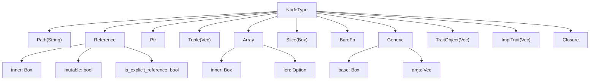
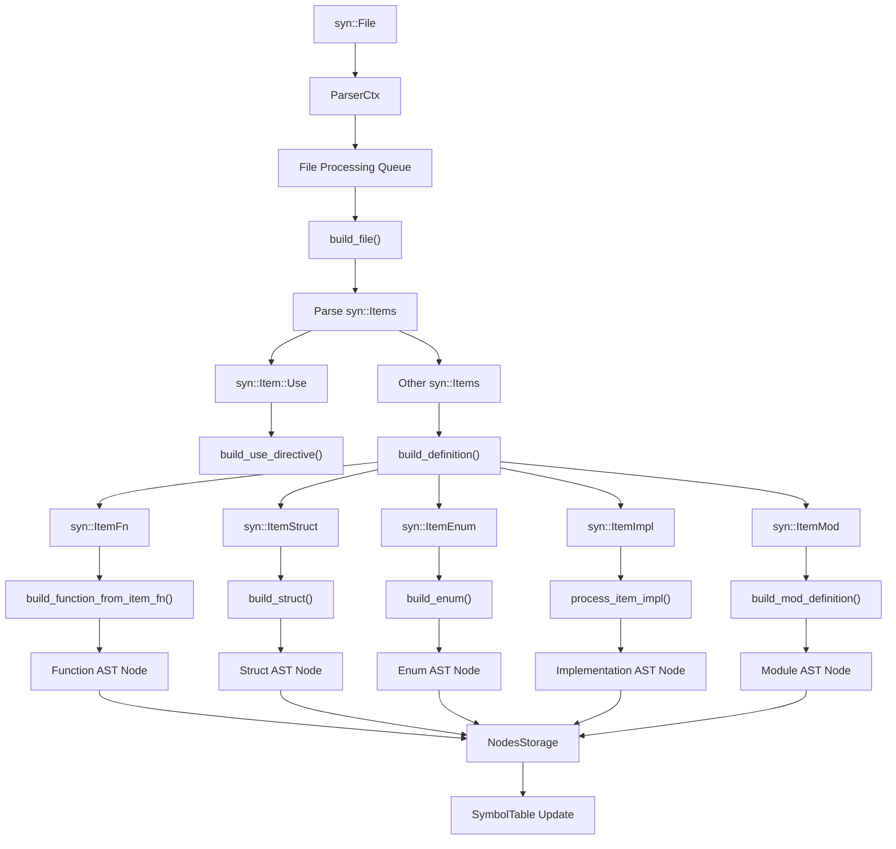
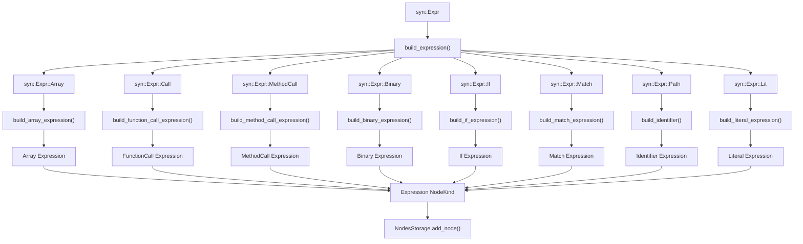
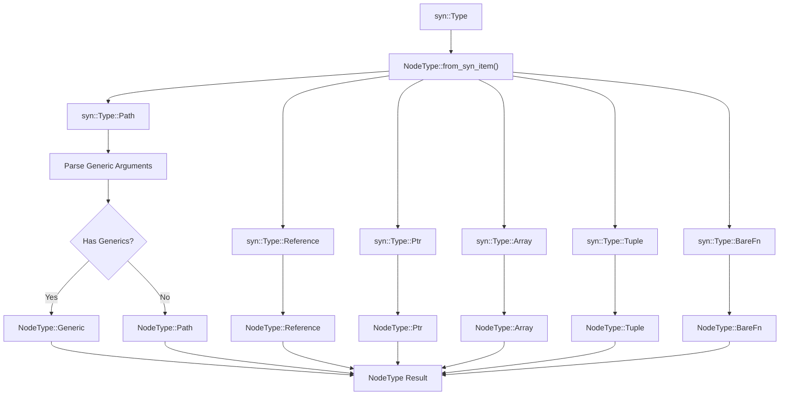
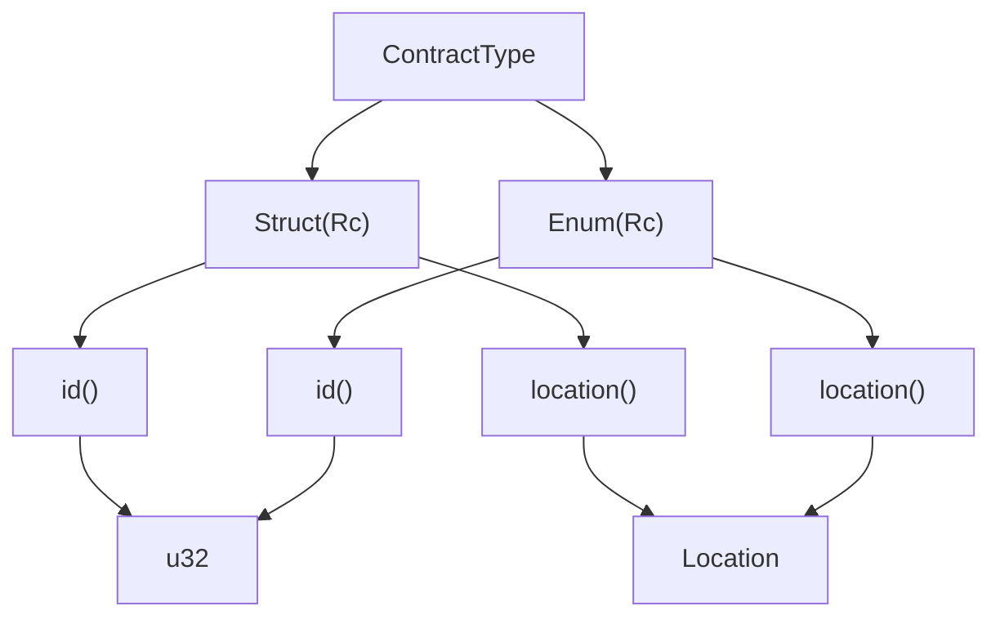

# AST System

## Purpose and Scope

The AST System provides a comprehensive Abstract Syntax Tree implementation for Rust code analysis in the Soroban
Security Detectors SDK. This system transforms raw Rust source code into a structured, queryable representation that
enables sophisticated security analysis.

The AST System covers node type definitions, infrastructure for location tracking and traversal, and the construction
process that builds the AST from `syn` parser output. For information about how the AST integrates with symbol
resolution and type inference, see [Symbol Table and Analysis](5_Symbol_Table_and_Analysis.md). For details on how the
constructed AST is stored and
managed, see [Codebase Management](6_Codebase_Management.md).

## Core AST Node Hierarchy

The AST system defines a comprehensive hierarchy of node types that represent all Rust language constructs relevant to
security analysis.

### AST Node Type Structure

```mermaid
graph TB
    NodeKind["NodeKind"]
    
    NodeKind --> File["File"]
    NodeKind --> Directive["Directive"]
    NodeKind --> Definition["Definition"]
    NodeKind --> Statement["Statement"]
    NodeKind --> Expression["Expression"]
    NodeKind --> Pattern["Pattern"]
    NodeKind --> Literal["Literal"]
    NodeKind --> Type["Type"]
    NodeKind --> Misc["Misc"]
    
    Definition --> Function["Function"]
    Definition --> Struct["Struct"]
    Definition --> Enum["Enum"]
    Definition --> Implementation["Implementation"]
    Definition --> Const["Const"]
    Definition --> Static["Static"]
    Definition --> Module["Module"]
    Definition --> Trait["Trait"]
    
    Expression --> FunctionCall["FunctionCall"]
    Expression --> MethodCall["MethodCall"]
    Expression --> Identifier["Identifier"]
    Expression --> Binary["Binary"]
    Expression --> Unary["Unary"]
    Expression --> If["If"]
    Expression --> Match["Match"]
    Expression --> Loop["Loop"]
    Expression --> Block["Block"]
    
    Statement --> ExpressionStmt["Expression"]
    Statement --> LetStmt["Let"]
    Statement --> BlockStmt["Block"]
    
    Literal --> LInt["LInt"]
    Literal --> LString["LString"]
    Literal --> LBool["LBool"]
    Literal --> LFloat["LFloat"]
```



### Type Annotation System

The `NodeType` enum provides a sophisticated type annotation system for representing Rust type expressions:



## AST Construction Pipeline

The AST construction process transforms `syn` parser output into the SDK's internal AST representation through a
systematic pipeline.

### ParserCtx Construction Flow



### Expression Building Process



## Node Infrastructure

The AST system provides essential infrastructure for node management, location tracking, and tree traversal.

### Core Node Interface

| Component         | Type   | Purpose                          |
|-------------------|--------|----------------------------------|
| `Node` trait      | Trait  | Core interface for all AST nodes |
| `Location` struct | Struct | Source position tracking         |
| `Visibility` enum | Enum   | Access modifier representation   |
| `NodeKind` enum   | Enum   | Type-safe node container         |

The `Node` trait provides the fundamental interface implemented by all AST nodes:

```rust
pub trait Node {
    fn id(&self) -> u32;
    fn location(&self) -> Location;
    fn node_type_name(&self) -> String;
    fn children(&self) -> Vec<NodeKind>;
    fn sorted_children(&self) -> Vec<NodeKind>;
}
```

### Location Tracking System

The `Location` struct provides precise source position information for every AST node:

| Field          | Type     | Purpose                    |
|----------------|----------|----------------------------|
| `offset_start` | `u32`    | Byte offset start position |
| `offset_end`   | `u32`    | Byte offset end position   |
| `start_line`   | `u32`    | Line number start          |
| `start_column` | `u32`    | Column number start        |
| `end_line`     | `u32`    | Line number end            |
| `end_column`   | `u32`    | Column number end          |
| `source`       | `String` | Source code text           |

### AST Macro System

The SDK provides powerful macros for AST node definition and implementation:

| Macro            | Purpose                                                   |
|------------------|-----------------------------------------------------------|
| `ast_node!`      | Define AST node structs with automatic id/location fields |
| `ast_enum!`      | Define AST enums with automatic trait implementations     |
| `ast_node_impl!` | Implement Node trait for structs                          |
| `location!`      | Extract location from syn spans                           |

## Type System Integration

The AST system integrates closely with Rust's type system through the `NodeType` enum and type inference capabilities.

### Type Annotation Processing



### Contract Type System

The AST system provides specialized support for Soroban contract types:



## Storage and Management

The AST system integrates with the broader codebase management through `NodesStorage` and `SymbolTable` coordination.

### Node Storage Integration

During AST construction, the `ParserCtx` systematically adds nodes to storage:

```rust
// Example from function call expression building
self .storage.add_node(
NodeKind::Statement(Statement::Expression(expr.clone())),
parent_id,
);
```

Each node is assigned a unique ID and linked to its parent, creating a hierarchical structure that supports efficient
traversal and analysis.

The AST System forms the foundation for all static analysis capabilities in the SDK, providing the structured
representation that enables sophisticated security detection patterns and symbol resolution.