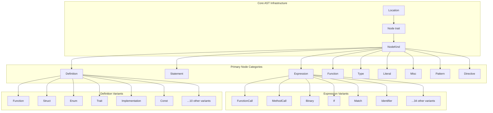
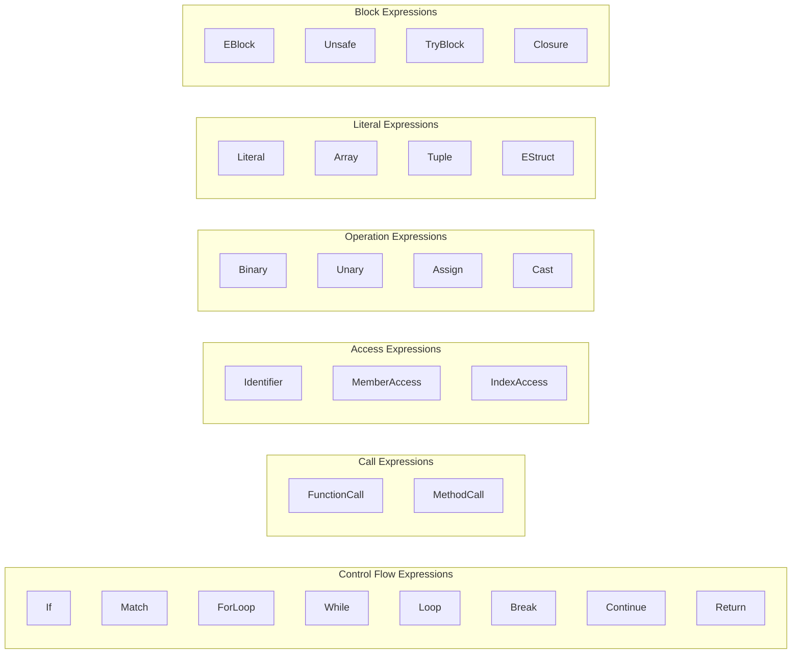
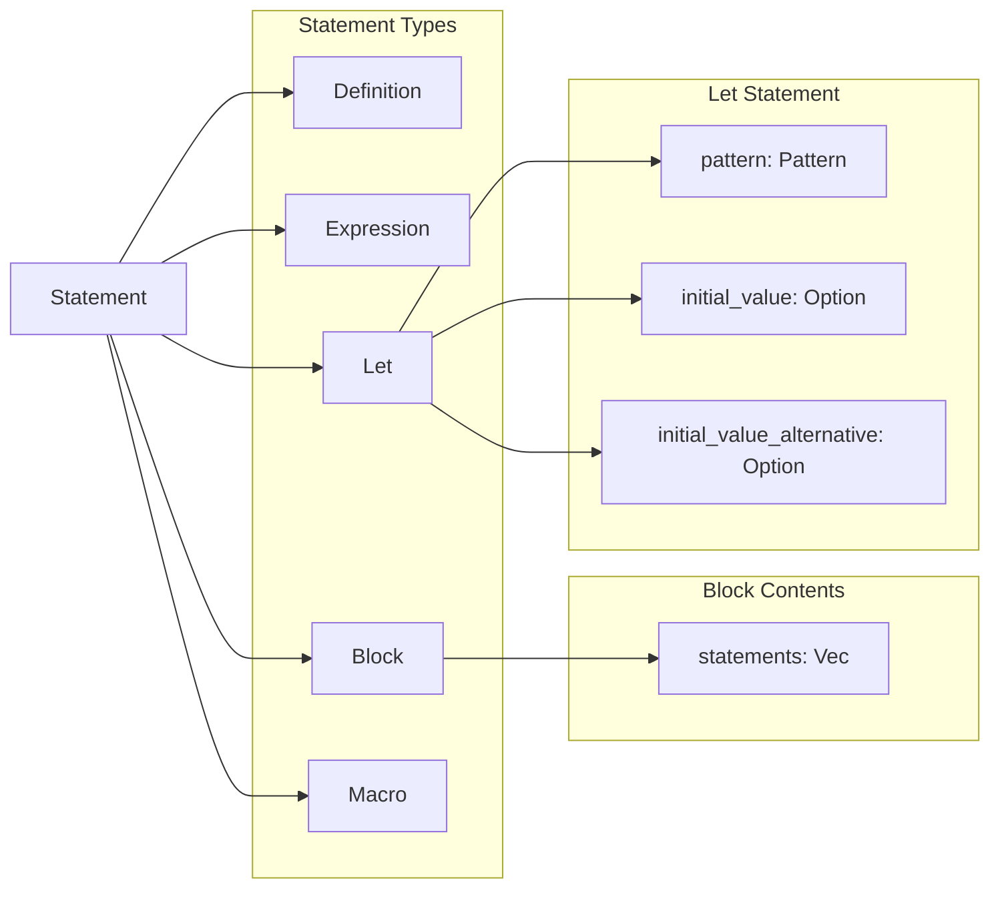
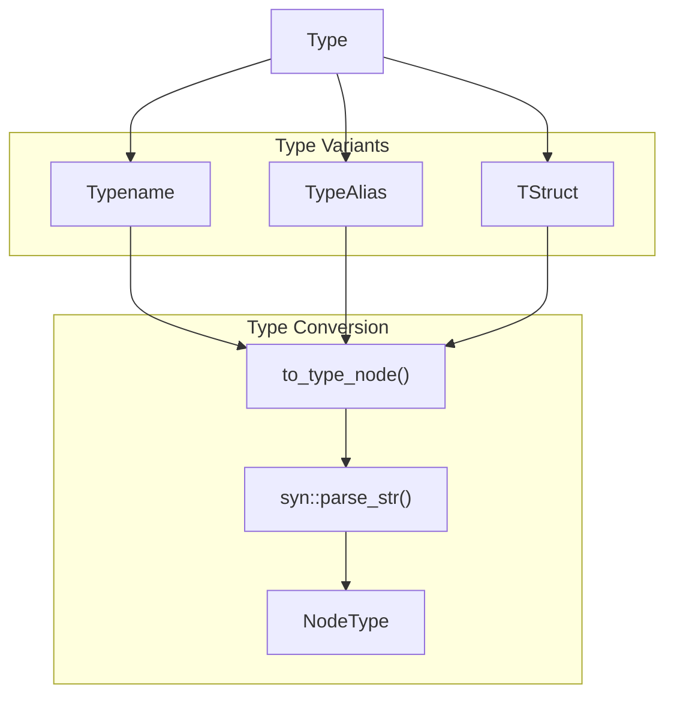
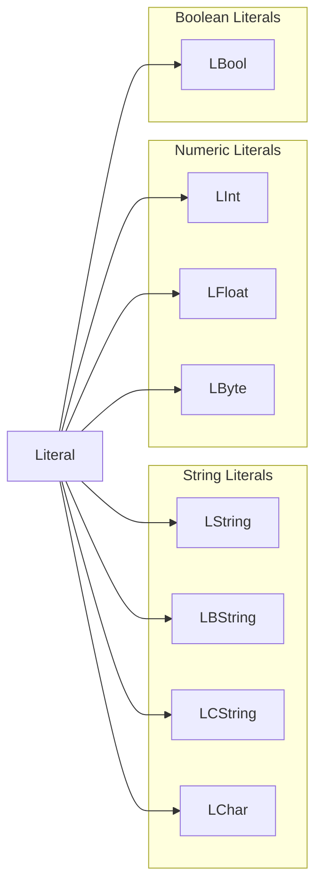
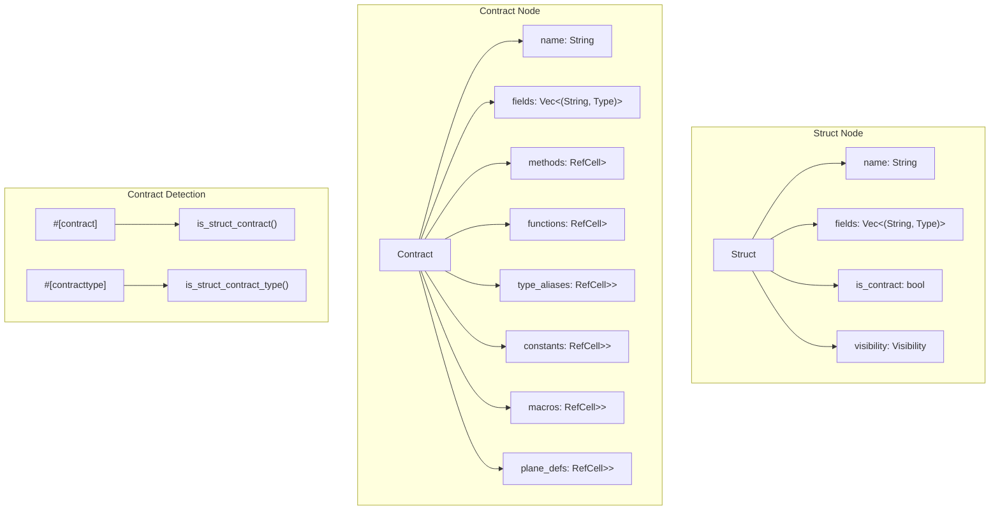
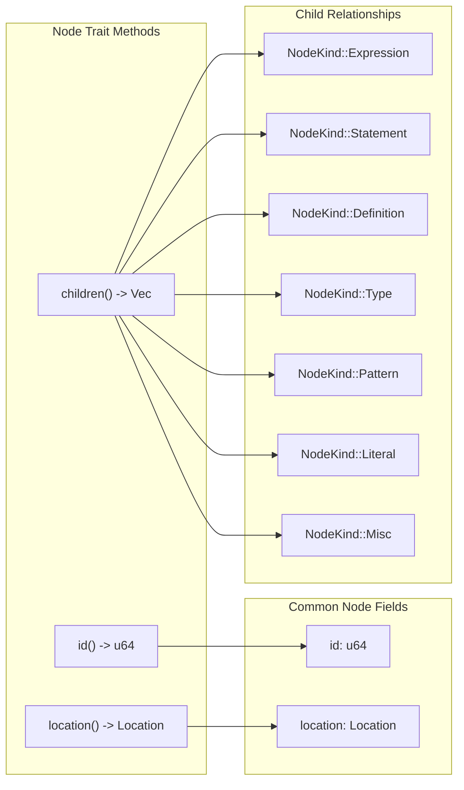

# AST Node Types

This document details the Abstract Syntax Tree (AST) node types that represent parsed Rust code in the Soroban Security
Detectors SDK. These nodes form the foundation for static analysis by providing a structured representation of source
code that security detectors can traverse and analyze.

The AST node types are organized into several categories representing different language constructs: expressions,
statements, definitions, functions, types, and literals. For information about how these nodes are constructed and
managed, see the AST System overview. For details about symbol resolution and type inference that operates on these
nodes, see [Symbol Table and Analysis](5_Symbol_Table_and_Analysis.md).

## AST Node Hierarchy Overview

The AST system is built around a central `NodeKind` enum that unifies all node types under a common interface. Each node
implements the `Node` trait, providing unique identifiers, location information, and child relationships.

## Expression Nodes

The `Expression` enum represents all Rust expression forms and is the most comprehensive node category with 34 variants.
Each expression node tracks whether it represents a return value through the `is_ret` field.

### Key Expression Types

| Expression Type | Purpose                | Key Fields                                |
|-----------------|------------------------|-------------------------------------------|
| `FunctionCall`  | Function invocation    | `function_name`, `parameters`             |
| `MethodCall`    | Method invocation      | `method_name`, `base`, `parameters`       |
| `Binary`        | Binary operations      | `left`, `right`, `operator`               |
| `If`            | Conditional expression | `condition`, `then_branch`, `else_branch` |
| `Match`         | Pattern matching       | `expression`, `arms`                      |
| `Identifier`    | Variable reference     | `name`                                    |
| `MemberAccess`  | Field access           | `base`, `member_name`                     |

## Definition Nodes

The `Definition` enum represents top-level items in Rust code including functions, structs, enums, traits, and
implementations. These nodes form the primary structure of modules and contracts.

```mermaid
graph TB
    subgraph "Type Definitions"
        Struct["Struct"]
        Contract["Contract"]
        Enum["Enum"]
        Union["Union"]
        TypeAlias["TypeAlias"]
    end
    
    subgraph "Behavioral Definitions"
        Function["Function"]
        Implementation["Implementation"]
        Trait["Trait"]
        TraitAlias["TraitAlias"]
    end
    
    subgraph "Value Definitions"
        Const["Const"]
        Static["Static"]
    end
    
    subgraph "Module Definitions"
        Module["Module"]
        ExternCrate["ExternCrate"]
        Macro["Macro"]
    end
    
    subgraph "Special Definitions"
        AssocType["AssocType"]
        Plane["Plane"]
    end
    
    Definition --> Struct
    Definition --> Contract
    Definition --> Enum
    Definition --> Union
    Definition --> TypeAlias
    Definition --> Function
    Definition --> Implementation
    Definition --> Trait
    Definition --> TraitAlias
    Definition --> Const
    Definition --> Static
    Definition --> Module
    Definition --> ExternCrate
    Definition --> Macro
    Definition --> AssocType
    Definition --> Plane
```

### Definition Node Details

Each definition node provides `name()` and `visibility()` methods for consistent access to common properties across all
definition types.

| Definition Type  | Purpose             | Key Fields                              |
|------------------|---------------------|-----------------------------------------|
| `Function`       | Function definition | `name`, `parameters`, `body`, `returns` |
| `Struct`         | Struct definition   | `name`, `fields`, `is_contract`         |
| `Implementation` | Impl block          | `for_type`, `functions`, `constants`    |
| `Trait`          | Trait definition    | `name`, `items`, `supertraits`          |
| `Module`         | Module definition   | `name`, `definitions`, `imports`        |
| `Const`          | Constant definition | `name`, `type_`, `value`                |

## Statement and Block Nodes

The `Statement` enum represents executable code units and structural blocks within functions and other code bodies.

The `Block` node contains a vector of statements and implements the `Node` trait to provide child access for AST
traversal. The `Let` node represents variable declarations with optional initialization values.

## Type System Nodes

The `Type` enum represents Rust's type system within the AST, including user-defined types, type aliases, and struct
types.

### Type Node Structure

| Type Node   | Purpose               | Key Fields                 |
|-------------|-----------------------|----------------------------|
| `Typename`  | Simple type name      | `name`                     |
| `TypeAlias` | Type alias definition | `name`, `visibility`, `ty` |
| `TStruct`   | Struct type reference | `name`, `visibility`, `ty` |

The `Type` enum provides a `to_type_node()` method that converts AST type representations into `NodeType` instances for
type inference and analysis.

## Literal Nodes

The `Literal` enum represents all literal value types in Rust source code, providing typed representations of constant
values.

### Literal Value Types

| Literal Type | Rust Type         | Value Field     |
|--------------|-------------------|-----------------|
| `LString`    | String literal    | `value: String` |
| `LChar`      | Character literal | `value: char`   |
| `LInt`       | Integer literal   | `value: i128`   |
| `LFloat`     | Float literal     | `value: String` |
| `LBool`      | Boolean literal   | `value: bool`   |
| `LByte`      | Byte literal      | `value: u8`     |

All literal nodes implement the `Node` trait with empty `children()` methods since they represent leaf values in the
AST.

## Function and Parameter Nodes

Function nodes represent Rust function definitions with complete signature information, body statements, and parameter
details.

```mermaid
graph TB
    subgraph "Function Structure"
        Function["Function"]
        FnParameter["FnParameter"]
        Returns["returns: Rc<RefCell<NodeType>>"]
        Body["body: Option<Rc<Block>>"]
    end
    
    subgraph "Function Properties"
        Name["name: String"]
        Visibility["visibility: Visibility"]
        Generics["generics: Vec<String>"]
        Parameters["parameters: Vec<Rc<FnParameter>>"]
        Attributes["attributes: Vec<String>"]
    end
    
    subgraph "Parameter Properties"
        ParamName["name: String"]
        ParamType["type_name: String"]
        IsSelf["is_self: bool"]
        IsMut["is_mut: bool"]
    end
    
    Function --> Name
    Function --> Visibility
    Function --> Generics
    Function --> Parameters
    Function --> Attributes
    Function --> Returns
    Function --> Body
    
    FnParameter --> ParamName
    FnParameter --> ParamType
    FnParameter --> IsSelf
    FnParameter --> IsMut
```

### Function Analysis Methods

The `Function` node provides several analysis methods:

| Method         | Purpose                       | Return Type                             |
|----------------|-------------------------------|-----------------------------------------|
| `parameters()` | Iterate function parameters   | `impl Iterator<Item = Rc<FnParameter>>` |
| `generics()`   | Iterate generic parameters    | `impl Iterator<Item = String>`          |
| `body()`       | Get function body             | `Option<Rc<Block>>`                     |
| `is_public()`  | Check public visibility       | `bool`                                  |
| `is_method()`  | Check if function is a method | `bool`                                  |

## Contract and Struct Nodes

Contract and struct nodes represent Soroban smart contracts and Rust struct definitions, with special handling for
contract-specific attributes and associated items.

### Contract vs Struct Distinction

The `Struct` node includes an `is_contract` field that distinguishes between regular Rust structs and Soroban contract
structs. Contract detection is performed using attribute analysis:

- `is_struct_contract()` checks for `#[contract]` attribute
- `is_struct_contract_type()` checks for `#[contracttype]` attribute

The `Contract` node provides organized access to contract components through methods like `functions()`, `methods()`,
and their corresponding count methods.

## Node Implementation Details

All AST nodes implement the `Node` trait, which provides a consistent interface for traversal and analysis. The trait
includes:

The `children()` method returns a vector of `NodeKind` variants, enabling recursive traversal of the AST. Each node type
implements specific child relationship logic based on its structure - for example, `Binary` expressions return their
left and right operands, while `Function` nodes return their parameters and body statements.

