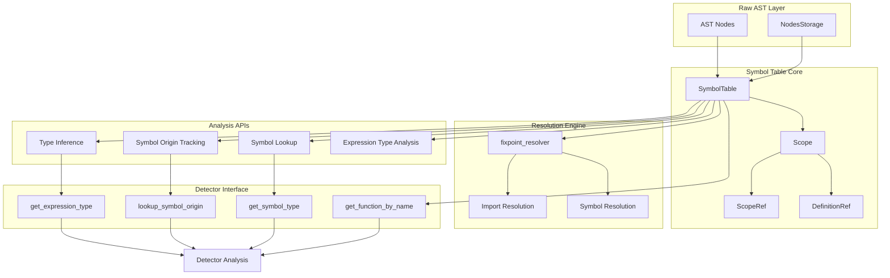
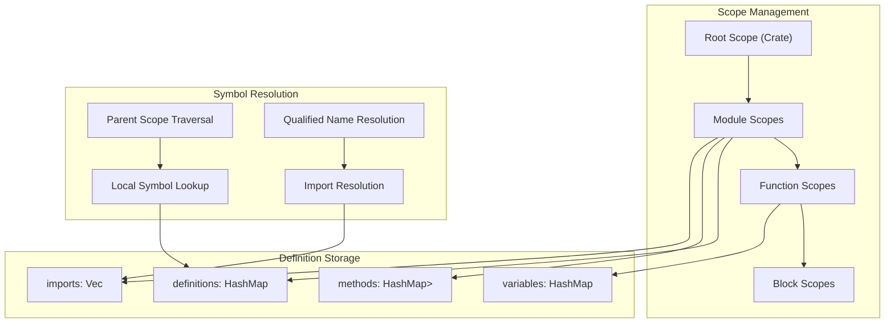
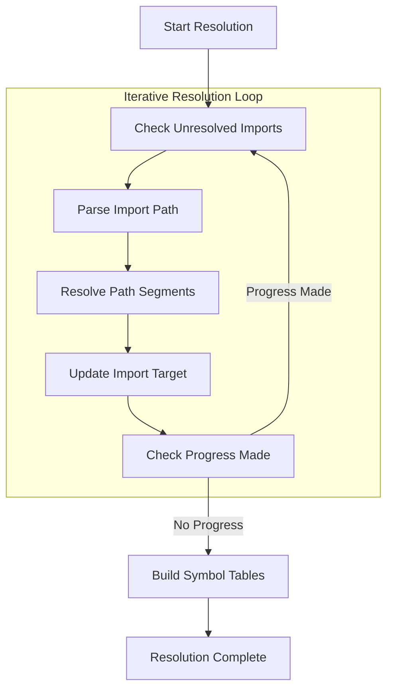
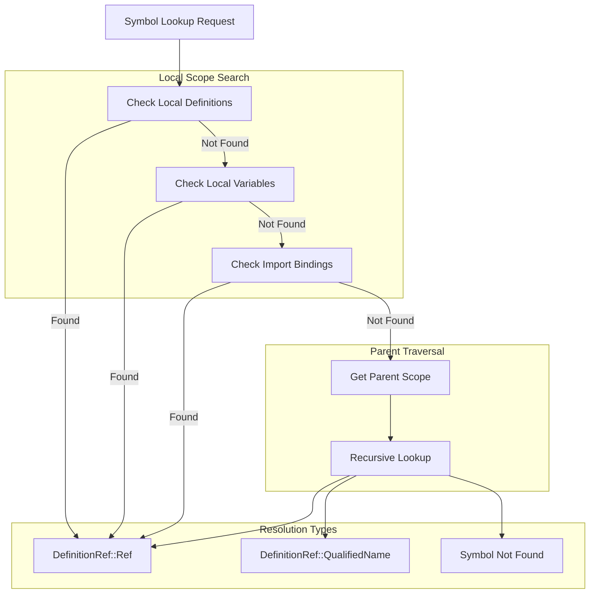
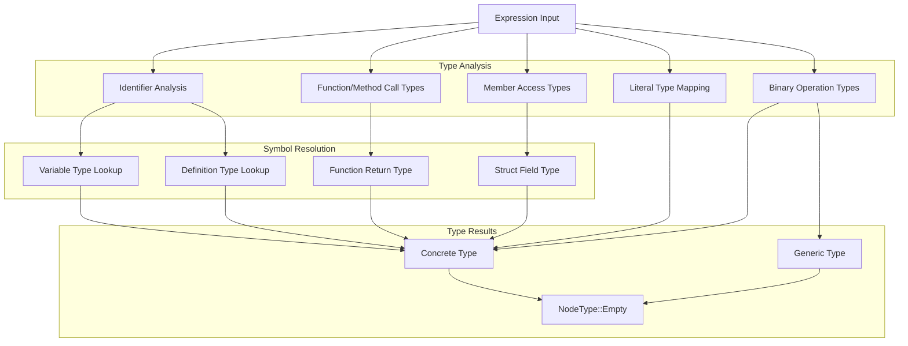
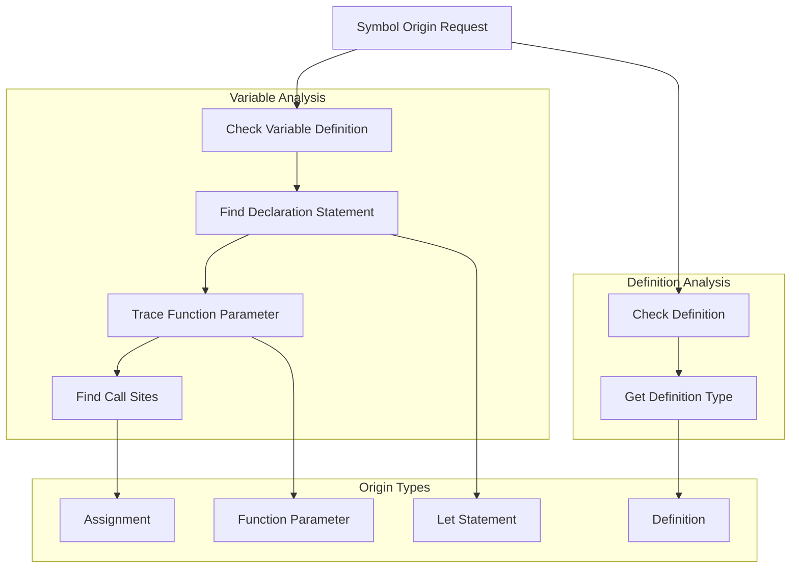
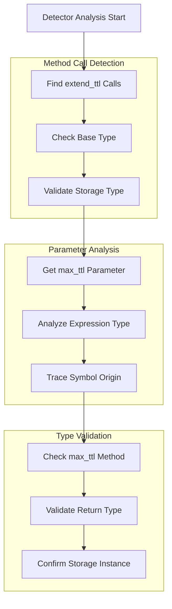

# Symbol Table and Analysis

This document covers the symbol table and semantic analysis system that provides rich code understanding capabilities
for security detectors. The system manages scope hierarchies, resolves symbols, performs type inference, and tracks
symbol origins across Rust/Soroban codebases.

For information about the basic AST node structure, see [AST Node Types](4_AST_Node_Types.md). For details about how
detectors use these analysis capabilities, see [Security Detectors](7_Security_Detectors.md).

## Architecture Overview

The symbol table system forms the semantic analysis layer of the SDK, built on top of the AST infrastructure to provide
deep code understanding.

### Symbol Table System Architecture



**Sources**: [sdk/src/symbol_table.rs:1-881]()

### Scope Hierarchy and Definition Management



## Core Components

### SymbolTable Class

The `SymbolTable` is the main coordinator for all symbol resolution and analysis operations:

| Component    | Type                                 | Purpose                            |
|--------------|--------------------------------------|------------------------------------|
| `scopes`     | `HashMap<u32, ScopeRef>`             | Maps scope IDs to scope references |
| `mod_scopes` | `HashMap<String, ScopeRef>`          | Maps module names to their scopes  |
| `defs`       | `HashMap<(u32, String), Definition>` | Stores qualified definitions       |

### Scope Structure

Each `Scope` maintains its own symbol namespace and hierarchy:

| Field         | Type                               | Description                |
|---------------|------------------------------------|----------------------------|
| `id`          | `u32`                              | Unique scope identifier    |
| `name`        | `String`                           | Qualified scope name       |
| `parent`      | `Option<ScopeRef>`                 | Parent scope reference     |
| `children`    | `Vec<ScopeRef>`                    | Child scopes               |
| `definitions` | `HashMap<String, Definition>`      | Local definitions          |
| `variables`   | `HashMap<String, (u32, NodeType)>` | Local variables with types |
| `methods`     | `HashMap<String, Vec<Function>>`   | Type methods               |
| `imports`     | `Vec<Use>`                         | Import declarations        |

### Definition References

The system uses `DefinitionRef` to handle both resolved and unresolved symbol references:

```rust
pub(crate) enum DefinitionRef {
    Ref(String, Definition),     // Resolved reference
    QualifiedName(String),       // Unresolved qualified name
}
```

## Symbol Resolution Process

### Fixpoint Resolution Algorithm

The `fixpoint_resolver` implements an iterative algorithm to resolve all imports and symbol references:



### Symbol Lookup Hierarchy

The system resolves symbols through a hierarchical lookup process:



## Type Inference System

### Expression Type Analysis

The system provides sophisticated type inference for expressions through `infer_expr_type`:

| Expression Type | Type Resolution Strategy           |
|-----------------|------------------------------------|
| `Identifier`    | Variable lookup or definition type |
| `Literal`       | Built-in primitive types           |
| `Binary`        | Operand type matching              |
| `MethodCall`    | Method signature analysis          |
| `FunctionCall`  | Function return type               |
| `MemberAccess`  | Struct field types                 |

### Type Inference Flow



## Analysis Capabilities for Detectors

### Symbol Origin Tracking

The `lookup_symbol_origin` function provides detailed provenance information for symbols:



### Detector API Integration

The symbol table provides high-level APIs used by detectors:

| API Function           | Purpose                      | Usage Example                              |
|------------------------|------------------------------|--------------------------------------------|
| `get_expression_type`  | Get type of any expression   | Type checking in `extend_ttl_with_max_ttl` |
| `lookup_symbol_origin` | Track symbol provenance      | Variable flow analysis                     |
| `get_symbol_type`      | Get variable type in scope   | Type validation                            |
| `get_function_by_name` | Resolve function definitions | Function inlining                          |

## Integration with Detector Framework

### Type-Based Analysis in Detectors

The `ExtendTtlWithMaxTtl` detector demonstrates sophisticated type analysis:



### Symbol Analysis in Practice

The detector framework leverages symbol table capabilities for complex analysis patterns:

```rust
// Type checking for method calls
codebase.get_expression_type(mc.base.id()).name().starts_with("soroban_sdk::storage")

// Symbol origin tracking
codebase.lookup_symbol_origin(scope_container.id(), id.name.as_str())

// Function resolution
codebase.get_function_by_name(scope_id, function_call.function_name.as_str())
```

