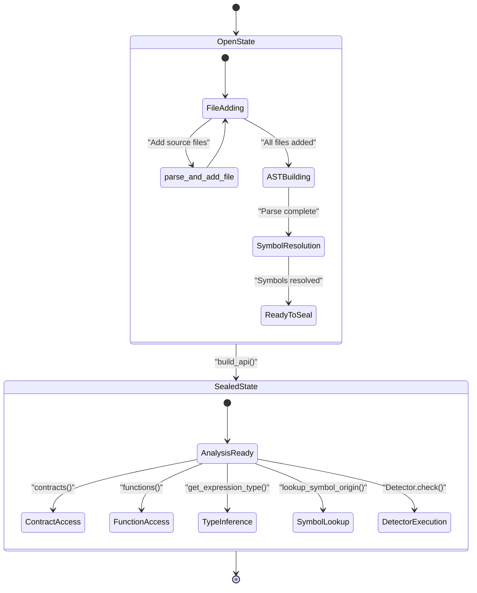
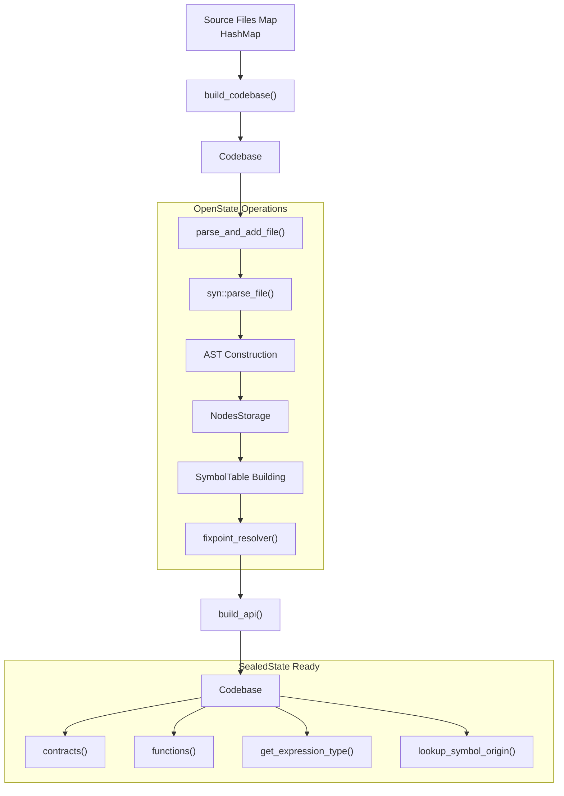
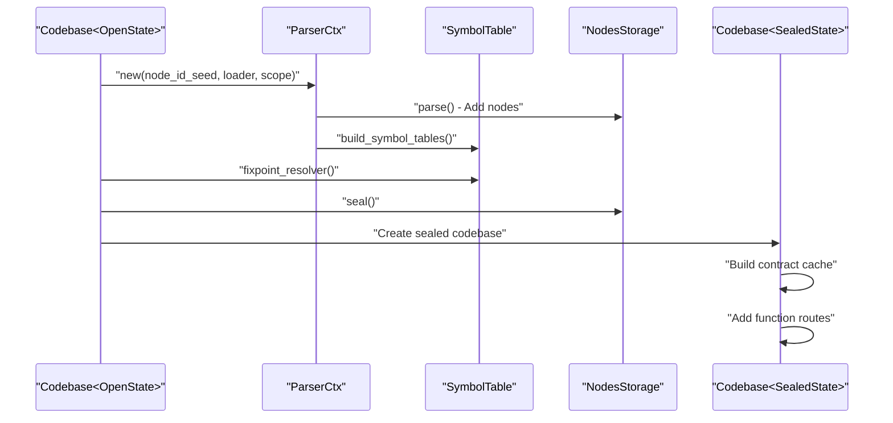
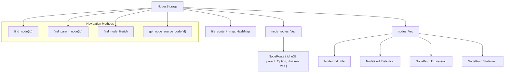
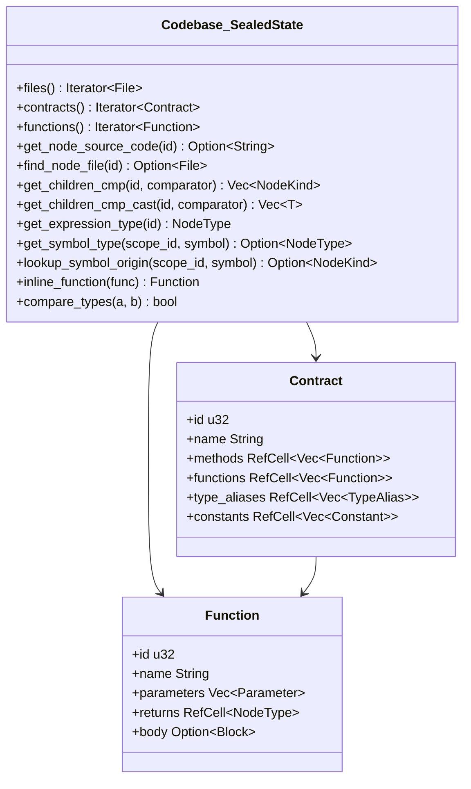
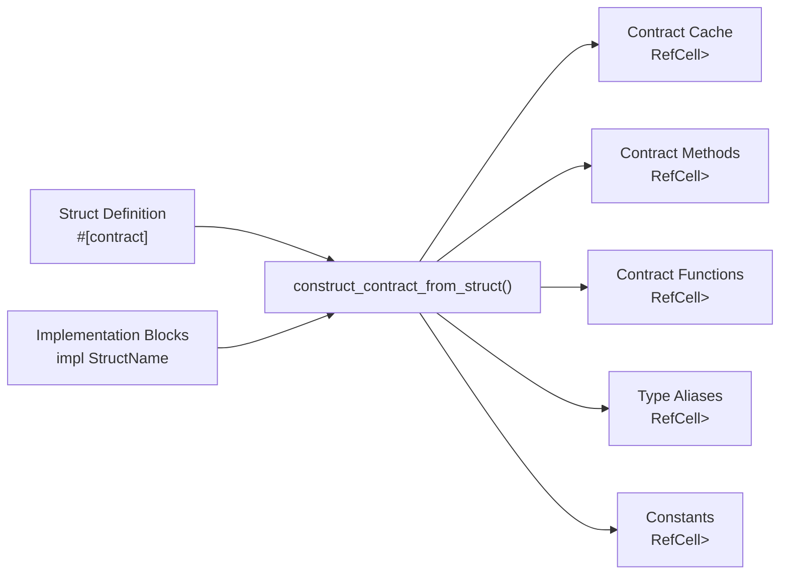

# Codebase Management

This document covers the lifecycle management of codebases in the Soroban Security Detectors SDK, focusing on how source
files are parsed, organized, and made available for analysis through a type-safe state management system.

The codebase management system handles the transition from raw source files to a fully analyzable code model through
distinct construction and sealing phases. For information about AST node types and structures,
see [AST Node Types](4_AST_Node_Types.md). For symbol resolution and type inference capabilities,
see [Symbol Table and Analysis](5_Symbol_Table_and_Analysis.md).

## State Management Overview

The codebase uses a type-state pattern to enforce correct usage through the compilation lifecycle. The `Codebase<S>`
struct is parameterized by state, ensuring that construction operations are only available during the open phase and
analysis operations are only available after sealing.

### Codebase State Diagram

## Construction Process

The codebase construction follows a multi-phase process that transforms raw source files into a fully analyzed code
model.

### Construction Pipeline

### File Processing

The system processes files through several steps:

| Phase               | Function                | Purpose                                   |
|---------------------|-------------------------|-------------------------------------------|
| Parsing             | `parse_and_add_file()`  | Converts source text to `syn::File` AST   |
| Storage             | `add_node()`            | Stores AST nodes in `NodesStorage`        |
| Symbol Resolution   | `build_symbol_tables()` | Builds symbol table and scope information |
| Fixpoint Resolution | `fixpoint_resolver()`   | Resolves imports and external references  |
| Sealing             | `build_api()`           | Transitions to immutable analysis state   |

## Sealing Process

The sealing process transitions the codebase from a mutable construction state to an immutable analysis state, enabling
type-safe access to analysis APIs.

### Sealing Implementation

The sealing process performs several critical operations:

1. **Parser Context Creation**: Creates a `ParserCtx` with a synthetic root scope
2. **AST Parsing**: Processes all files and builds the node tree
3. **Symbol Resolution**: Resolves all imports and external references through `fixpoint_resolver`
4. **Storage Sealing**: Finalizes parent-child relationships in `NodesStorage`
5. **Contract Cache**: Builds cache of contract structures for efficient access
6. **Route Establishment**: Links contract methods and functions to their parent structs

## Storage Management

The `NodesStorage` system manages AST nodes and their relationships through a graph-based approach.

### Node Storage Architecture

### Storage Operations

The storage system provides several key operations:

- **Node Lookup**: `find_node(id)` retrieves any node by its unique identifier
- **Parent Traversal**: `find_parent_node(id)` walks up the hierarchy
- **File Resolution**: `find_node_file(id)` finds the source file containing a node
- **Source Code Access**: `get_node_source_code(id)` extracts original source text

## API Access Patterns

Once sealed, the codebase provides rich APIs for analysis and traversal.

### Sealed Codebase APIs

### Analysis Capabilities

The sealed codebase provides sophisticated analysis capabilities:

| Method                                   | Purpose                            | Return Type          |
|------------------------------------------|------------------------------------|----------------------|
| `contracts()`                            | Enumerate all contract structures  | `Iterator<Contract>` |
| `functions()`                            | Enumerate all function definitions | `Iterator<Function>` |
| `get_expression_type(id)`                | Infer expression types             | `NodeType`           |
| `lookup_symbol_origin(scope_id, symbol)` | Find symbol definitions            | `Option<NodeKind>`   |
| `inline_function(func)`                  | Inline function calls for analysis | `Function`           |
| `get_children_cmp(id, comparator)`       | Find child nodes matching criteria | `Vec<NodeKind>`      |

### Contract Construction

The system automatically constructs `Contract` objects from `struct` definitions marked with contract attributes,
gathering associated implementation blocks:

