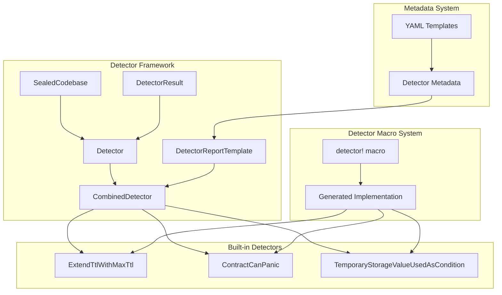
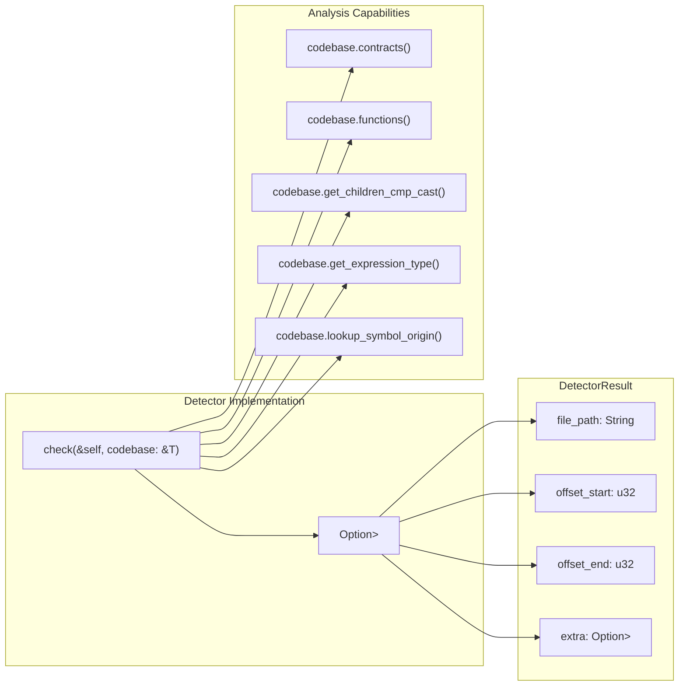
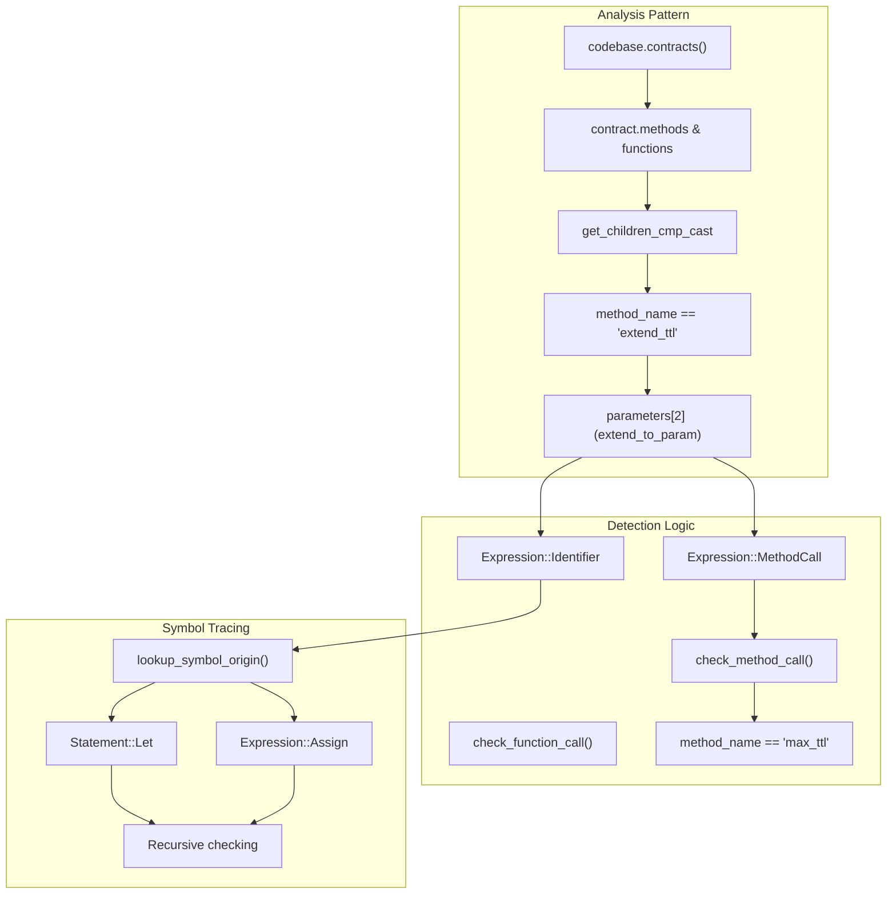
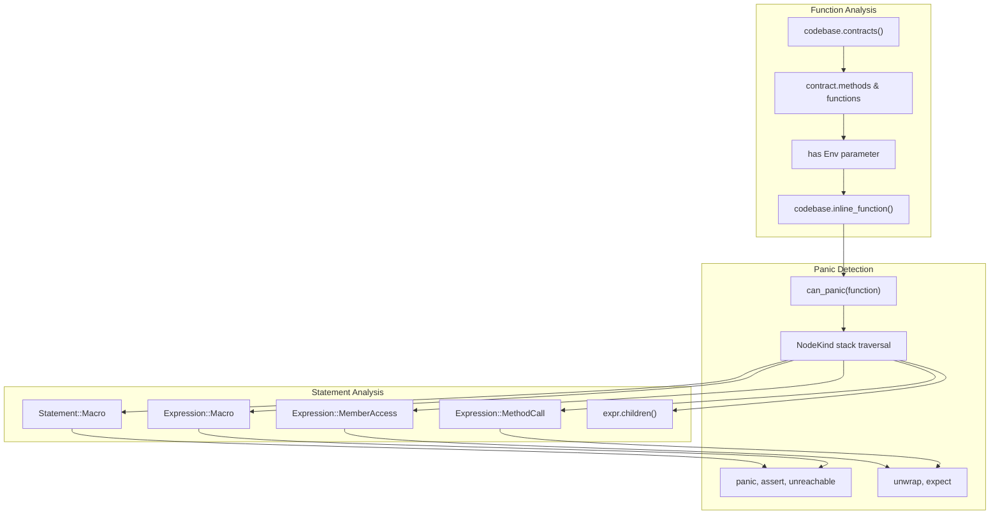
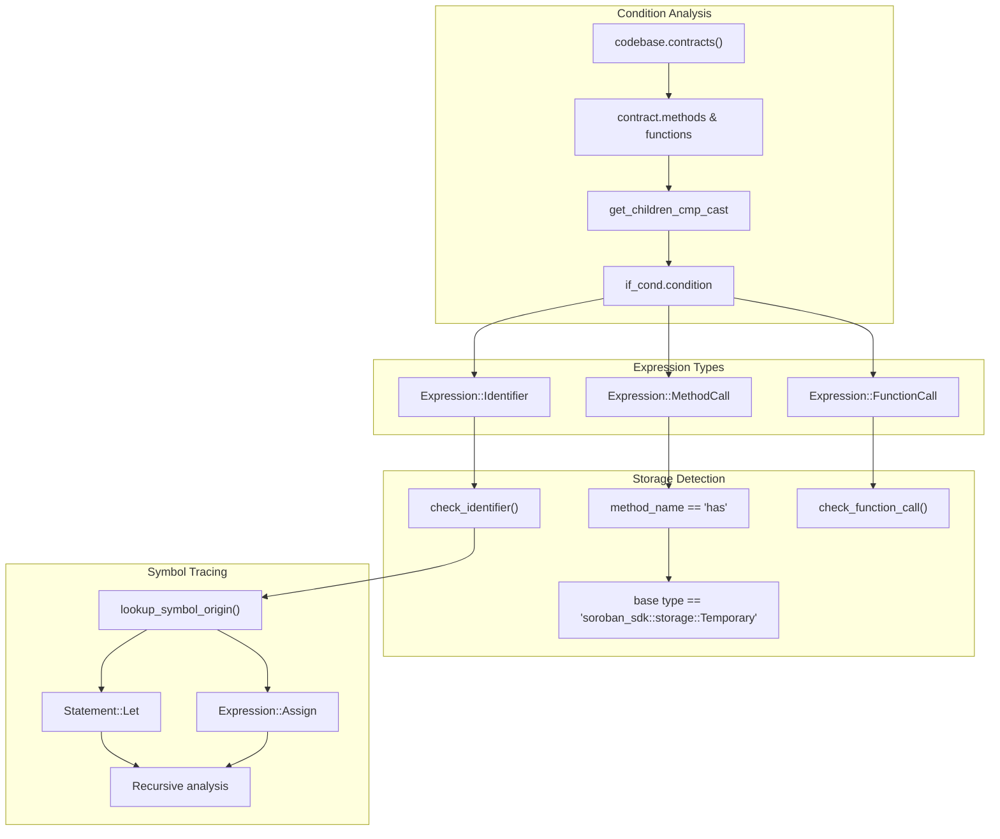
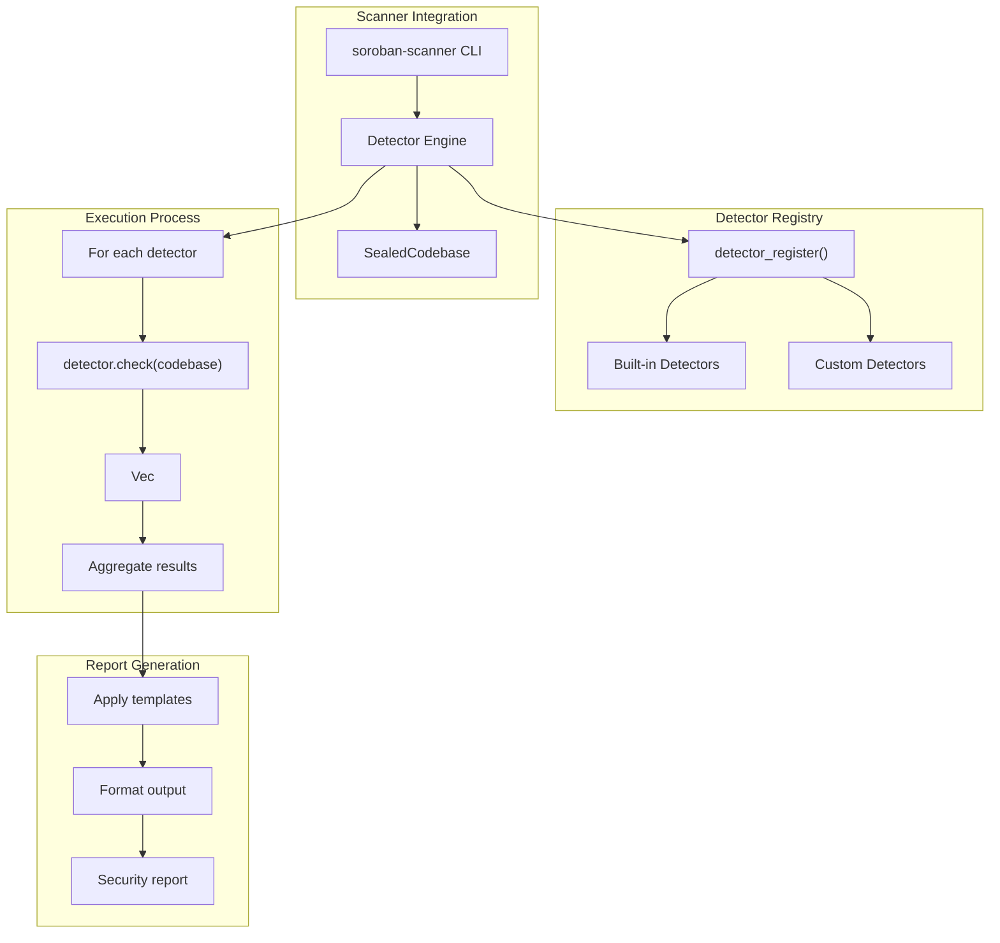

# Security Detectors

This document explains the security detector framework and built-in detectors that analyze Soroban smart contracts for
vulnerability patterns. Security detectors implement specific analysis logic that operates on the parsed codebase to
identify potential security issues.

For information about how codebases are constructed and sealed for analysis,
see [Codebase Management](6_Codebase_Management.md). For details
about the AST system that detectors analyze, see [AST System](3_AST_System.md).

## Detector Framework Architecture

The security detector framework provides a trait-based architecture for implementing security analysis rules. Each
detector implements the `Detector` trait and operates on a `SealedCodebase` to identify vulnerability patterns.

### Core Framework Components



**Detector Framework Architecture**

The framework consists of several key traits and types:

- `Detector<T>` - Core trait with `check` method that analyzes a codebase
- `DetectorReportTemplate` - Provides metadata and reporting templates
- `CombinedDetector<T>` - Union trait requiring both `Detector` and `DetectorReportTemplate`
- `DetectorResult` - Contains file path, offsets, and extra metadata for findings
- `SealedCodebase` - Type alias for `Codebase<SealedState>` that detectors analyze

### Detector Trait Interface



**Detector Interface and Analysis Flow**

The `check` method receives a `SealedCodebase` and returns an optional vector of `DetectorResult` objects. Each result
contains precise file offsets and optional metadata for template substitution.

## Built-in Detectors

The codebase includes three built-in detectors that demonstrate different analysis patterns and address specific Soroban
security concerns.

### ExtendTtlWithMaxTtl Detector

This detector identifies improper usage of `max_ttl` values in `extend_ttl` calls, which may not have the intended
effect.



**ExtendTtlWithMaxTtl Analysis Pattern**

The detector uses sophisticated symbol tracing to follow variable assignments and method calls to determine if the third
parameter of `extend_ttl` calls originates from a `max_ttl()` call.

### ContractCanPanic Detector

This detector identifies contract functions that may panic through `panic!`, `unwrap`, `expect`, or `assert` calls,
including indirect panics through function inlining.



**ContractCanPanic Analysis Pattern**

The detector uses function inlining to analyze complete execution paths and detect both direct and indirect panic
conditions. It performs stack-based traversal of all statements and expressions.

### TemporaryStorageValueUsedAsCondition Detector

This detector identifies unsafe usage of temporary storage values in conditional expressions, which may lead to
unexpected behavior.



**TemporaryStorageValueUsedAsCondition Analysis Pattern**

The detector analyzes if conditions to identify direct usage of temporary storage `has()` calls or variables that
originate from such calls through symbol tracing.

## Detector Metadata and Templates

Each detector has associated YAML metadata that defines reporting templates and severity levels. This metadata is used
to generate user-friendly security reports.

### Metadata Structure

| Field         | Purpose                    | Example                               |
|---------------|----------------------------|---------------------------------------|
| `id`          | Unique detector identifier | `extend-ttl-with-max-ttl`             |
| `uid`         | Short identifier           | `pQwXyZ`                              |
| `description` | Detector purpose           | Analysis description                  |
| `severity`    | Issue severity level       | `medium`, `high`, `low`               |
| `tags`        | Classification tags        | `audit`, `reportable`, `completeness` |
| `template`    | Report formatting          | Title, body, closing templates        |

### Template Variables

The metadata templates support variable substitution for contextual reporting:

- `$file_name` - Source file name
- `$CONTRACT_NAME` - Contract name from detector results
- `$FUNCTION_NAME` - Function name from detector results
- `$instance_line` - Line number of the finding
- `$instance_line_link` - Link to the specific line
- `$total_files` - Total number of files with issues

## Creating Custom Detectors

The `detector!` macro simplifies creating new detectors by automatically generating the struct and trait
implementations.

### Detector Macro Usage

```rust
soroban_security_detectors_sdk::detector! {
    #[type_name = MyDetector]
    fn my_detector<SealedCodebase>(codebase: &SealedCodebase) -> Option<Vec<DetectorResult>> {
        // Implementation logic
    }
}
```

The macro generates:

- A struct with the specified `type_name`
- Implementation of `Detector<SealedCodebase>`
- Integration with the detector framework

### Analysis Patterns

Common analysis patterns used by detectors:

1. **Contract Iteration**: `codebase.contracts()` to iterate over all contracts
2. **Function Analysis**: Access methods and functions through `contract.methods` and `contract.functions`
3. **AST Traversal**: Use `get_children_cmp_cast` to find specific node types
4. **Type Analysis**: Use `get_expression_type` to determine expression types
5. **Symbol Tracing**: Use `lookup_symbol_origin` to trace variable definitions
6. **Function Inlining**: Use `inline_function` for deep analysis of execution paths

## Detector Execution and Results

Detectors are executed through the scanner CLI and integrated into the broader security analysis pipeline.

### Execution Flow



**Detector Execution and Reporting Flow**

The scanner CLI orchestrates detector execution through a registry system, applies templates to results, and generates
formatted security reports.

### Testing Framework

The codebase includes comprehensive testing utilities for detector validation:

- `build_codebase` function for creating test codebases
- Synthetic source code examples in test cases
- Assertion helpers for verifying detector results
- Multi-file test scenarios for complex analysis

