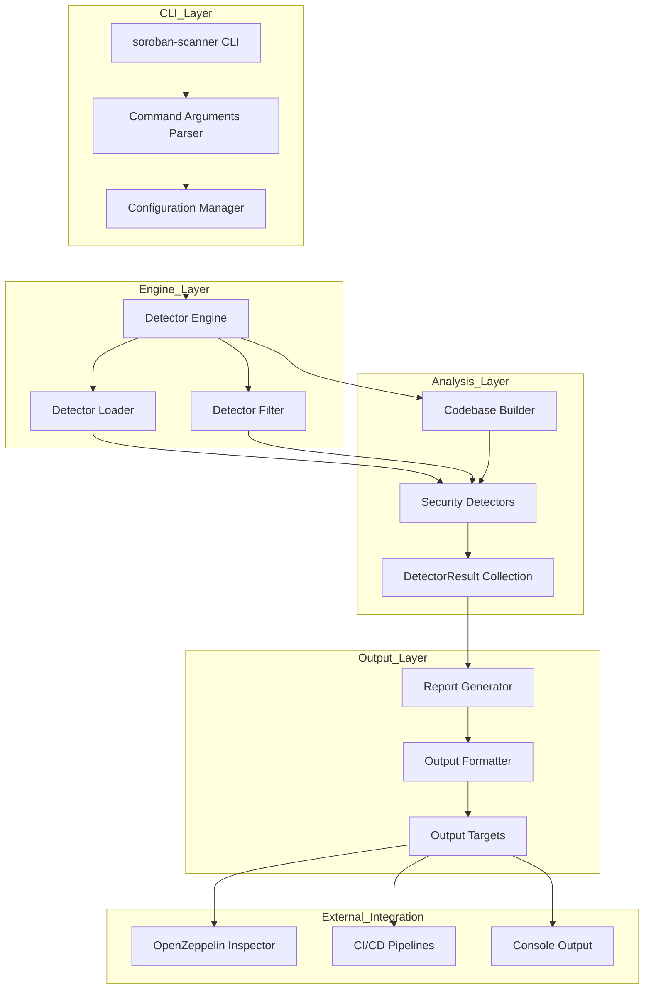
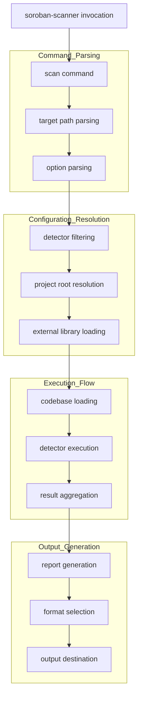
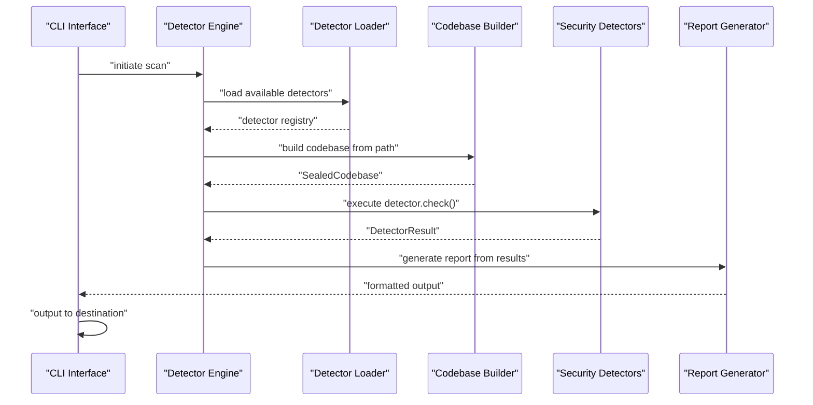
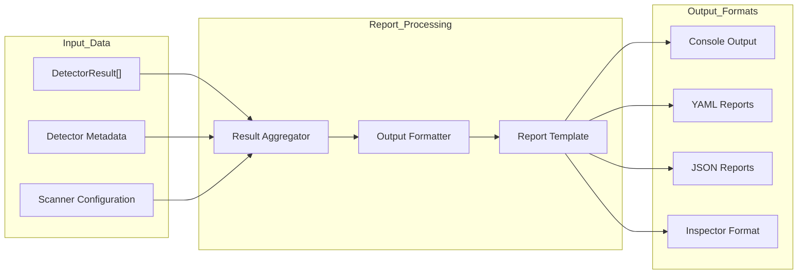
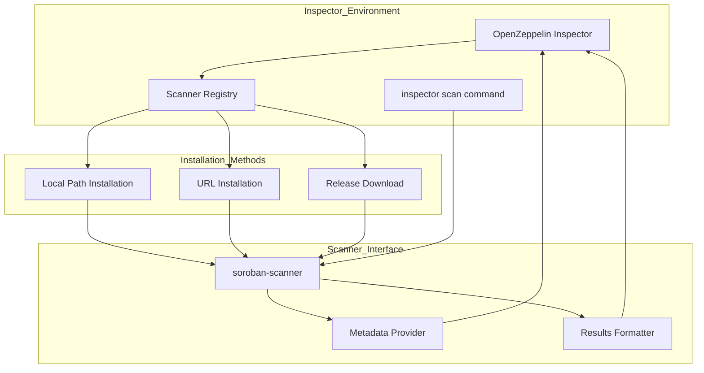
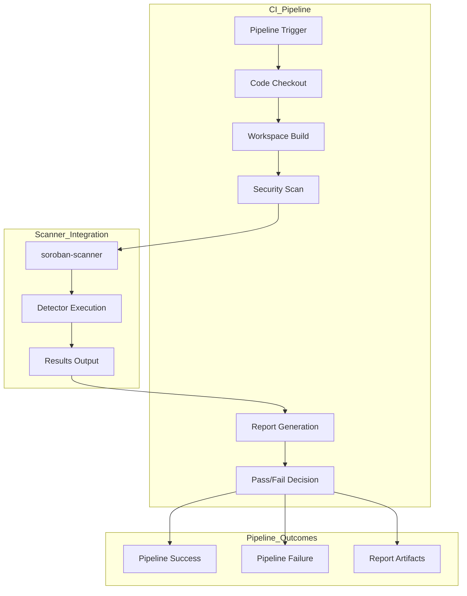

# CLI Scanner

This document covers the `soroban-scanner` command-line interface, which serves as the primary entry point for executing
security detectors against Soroban smart contract codebases. The CLI Scanner orchestrates the detection process, manages
configuration, and formats results for various output targets.

For information about the underlying detector framework and implementation details,
see [Security Detectors](7_Security_Detectors.md). For details about the AST system that powers the analysis,
see [AST System](3_AST_System.md).

## Purpose and Architecture

The CLI Scanner (`soroban-scanner`) is a standalone executable that provides a command-line interface for running
security analysis on Soroban smart contracts. It acts as the orchestration layer that coordinates between the core SDK
components and the detector implementations.

### Core Components Architecture



## Command-Line Interface

The CLI Scanner provides a structured command interface with the primary `scan` command and various configuration
options.

### Basic Usage Pattern



Sources: [README.md:40-63]()

### Command Structure

| Command          | Purpose                             | Example                                          |
|------------------|-------------------------------------|--------------------------------------------------|
| `scan`           | Execute security analysis           | `soroban-scanner scan path/to/contracts`         |
| `--detectors`    | Filter specific detectors           | `--detectors auth_missing unchecked_ft_transfer` |
| `--project-root` | Set project root for relative paths | `--project-root path/to`                         |
| `--load`         | Load external detector library      | `--load path/to/libmy_detector.so`               |

## Detector Engine Integration

The CLI Scanner integrates with the detector framework through a structured execution engine that manages detector
lifecycle and result aggregation.

### Detector Execution Flow



The detector engine manages the execution lifecycle, ensuring proper initialization of the codebase and coordinated
execution of all enabled detectors.

## Output and Reporting

The CLI Scanner generates structured reports that can be consumed by various downstream systems and tools.

### Report Generation Pipeline



## OpenZeppelin Inspector Integration

The CLI Scanner is fully compatible with OpenZeppelin Inspector's custom scanner interface, enabling seamless
integration into Inspector workflows.

### Inspector Integration Architecture



### Integration Commands

The integration supports multiple installation methods:

```bash
# Local installation
inspector scanner install /path/to/soroban-scanner

# URL-based installation
inspector scanner install https://github.com/OpenZeppelin/soroban-security-detectors-sdk/releases/latest/download/soroban-scanner-<os>-latest-v<version>.zip

# Execution through Inspector
inspector scan --scanner soroban-scanner path/to/your/soroban/project
```

## Configuration and Customization

The CLI Scanner supports various configuration options for customizing analysis behavior and output formatting.

### Configuration Options

| Option             | Purpose                                | Default           | Usage                             |
|--------------------|----------------------------------------|-------------------|-----------------------------------|
| Target Path        | Specifies contracts to analyze         | Required          | `scan path/to/contracts`          |
| Detector Filter    | Limits execution to specific detectors | All detectors     | `--detectors detector1 detector2` |
| Project Root       | Sets base path for relative references | Current directory | `--project-root path/to`          |
| External Libraries | Loads additional detector libraries    | None              | `--load path/to/lib.so`           |

### Workspace Integration

The CLI Scanner integrates with Cargo workspace structures for development and testing:

```bash
# Development execution
cargo run -p soroban-scanner -- scan path/to/contracts

# Workspace build
cargo build --workspace
```

## CI/CD Integration

The CLI Scanner is designed for integration into automated pipelines and continuous integration workflows.

### CI/CD Integration Points



The scanner's exit codes and structured output format make it suitable for automated decision-making in CI/CD pipelines,
allowing builds to fail when security issues are detected.