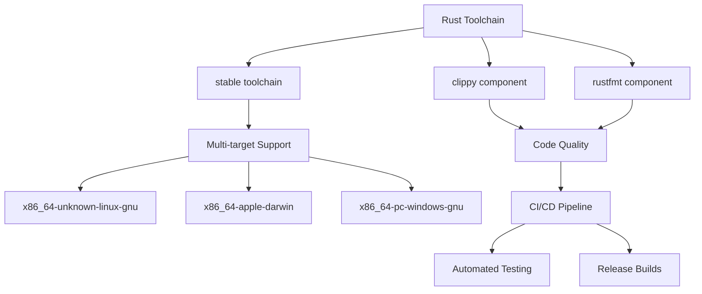
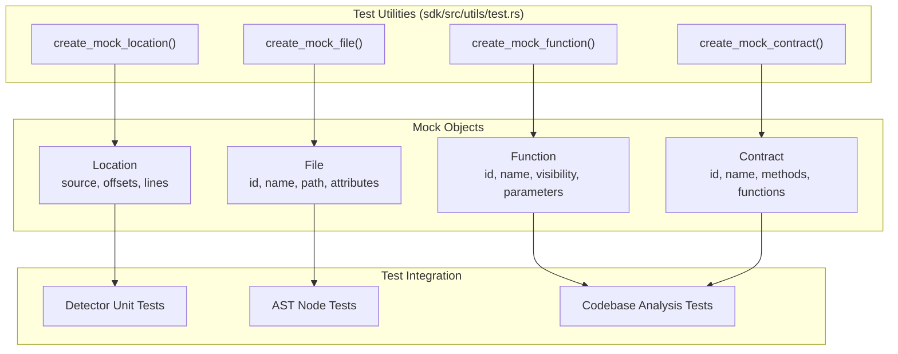
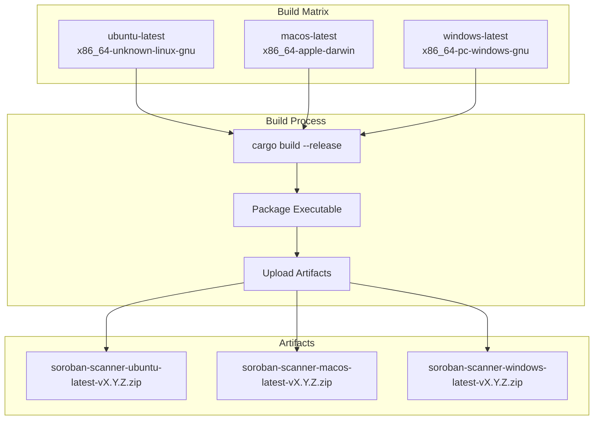
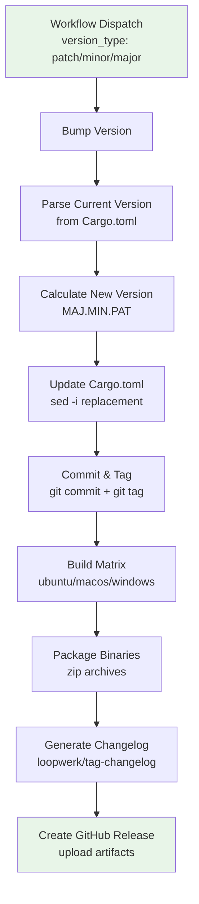
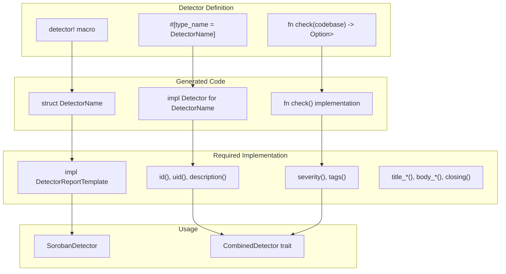
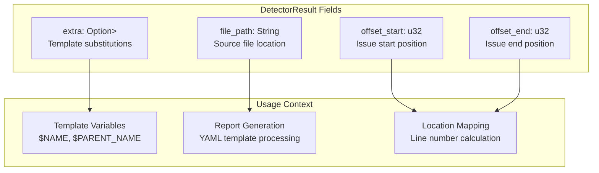
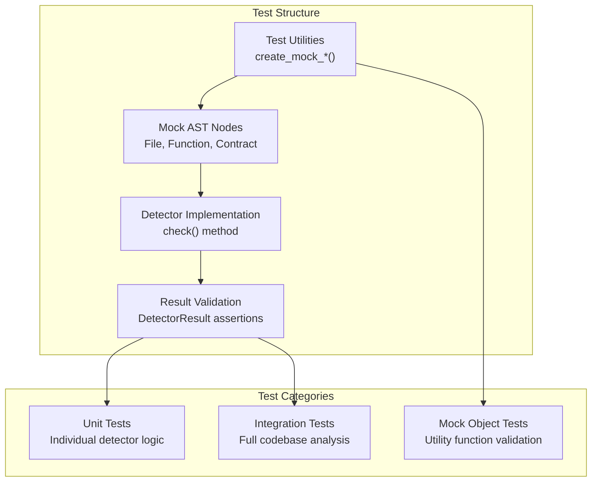

# Development Guide

This document provides comprehensive information for contributors to the Soroban Security Detectors SDK project. It
covers project structure, development environment setup, testing utilities, build processes, and release workflows. This
guide is intended for developers who want to contribute to the SDK core, implement custom detectors, or enhance the CLI
scanner.

For information about using the SDK to create security detectors, see [Security Detectors](7_Security_Detectors.md). For
details about the CLI scanner usage, see [CLI Scanner](8_CLI_Scanner.md).

## Project Structure

The Soroban Security Detectors SDK follows a multi-crate workspace architecture that separates concerns between core SDK
functionality, detector implementations, and command-line tools.

### Workspace Architecture

```mermaid
graph TB
    subgraph "Workspace Root"
        WS["Cargo.toml<br/>workspace = true"]
    end
    
    subgraph "sdk/"
        SDK["soroban-security-detectors-sdk<br/>Core AST & Analysis"]
        SDKC["Cargo.toml<br/>dependencies"]
    end
    
    subgraph "detectors/"
        DET["soroban-security-detectors<br/>Built-in Security Detectors"]
        DETC["Cargo.toml<br/>depends on sdk"]
    end
    
    subgraph "soroban-scanner/"
        CLI["soroban-scanner<br/>CLI Application"]
        CLIC["Cargo.toml<br/>depends on sdk + detectors"]
    end
    
    WS --> SDK
    WS --> DET
    WS --> CLI
    
    SDK --> DET
    SDK --> CLI
    DET --> CLI
    
    style "sdk/" fill:#e1f5fe
    style "detectors/" fill:#f3e5f5
    style "soroban-scanner/" fill:#e8f5e8
```

The workspace configuration defines shared version numbers, licensing, and dependency management across all crates. The
`resolver = "2"` setting enables Cargo's new dependency resolver for better version resolution.

### Crate Dependencies

| Crate                            | Purpose                                             | Key Dependencies                                               |
|----------------------------------|-----------------------------------------------------|----------------------------------------------------------------|
| `soroban-security-detectors-sdk` | Core AST parsing, symbol table, codebase management | `syn`, `quote`, `proc-macro2`, `serde`                         |
| `soroban-security-detectors`     | Built-in security detector implementations          | `soroban-security-detectors-sdk`                               |
| `soroban-scanner`                | CLI interface and detector execution engine         | `soroban-security-detectors-sdk`, `soroban-security-detectors` |

## Development Environment Setup

### Prerequisites

The project requires a standard Rust development environment with specific toolchain components for cross-platform
builds and quality checks.



### Local Development Setup

1. **Clone Repository**: Initialize with submodules for complete dependency resolution
2. **Install Rust**: Use the stable toolchain with required components
3. **Build Project**: Execute `cargo build` to compile all workspace members
4. **Run Tests**: Execute `cargo test` to verify installation

The workspace uses specific lint configurations to handle macro-generated code, particularly for the `unused_imports`
lint which is disabled due to macro expansion behavior.

## Testing Framework

The SDK provides comprehensive testing utilities for detector development and codebase analysis validation.

### Test Utilities Module



The test utilities provide factory functions for creating mock AST nodes and codebase elements. These utilities are
essential for writing unit tests for detectors without requiring full file parsing.

### Mock Object Creation

The testing framework offers several factory functions for creating test fixtures:

| Function                 | Purpose                      | Key Fields                                           |
|--------------------------|------------------------------|------------------------------------------------------|
| `create_mock_location()` | Creates location metadata    | `source`, `offset_start`, `offset_end`, `start_line` |
| `create_mock_file()`     | Creates file AST nodes       | `id`, `name`, `path`, `attributes`                   |
| `create_mock_function()` | Creates function definitions | `id`, `name`, `visibility`, `parameters`             |
| `create_mock_contract()` | Creates contract structures  | `id`, `name`, `methods`, `functions`                 |

These functions support parameterized creation for customized test scenarios, such as
`create_mock_function_with_parameters()` for testing function analysis.

### Example Test Pattern

```rust
#[test]
fn test_detector_logic() {
    let file = create_mock_file();
    let function = create_mock_function(1);
    // Test detector implementation
}
```

## Build Process

The build system supports multiple target platforms with automated cross-compilation for distribution.

### Build Targets and Matrix



The build process uses GitHub Actions to create platform-specific binaries. Each target produces a compressed archive
containing the `soroban-scanner` executable.

### Local Build Commands

| Command                 | Purpose                 |
|-------------------------|-------------------------|
| `cargo build`           | Build debug version     |
| `cargo build --release` | Build optimized version |
| `cargo test`            | Run all tests           |
| `cargo clippy`          | Run linter              |
| `cargo fmt`             | Format code             |

## Release Workflow

The project uses an automated release process with semantic versioning and cross-platform binary distribution.

### Release Process Flow



The release workflow supports three types of version bumps and automatically handles version string manipulation, git
operations, and artifact publication.

### Version Management

The version bumping logic uses shell scripting to parse and increment semantic version numbers:

```bash
# Current version extraction
CUR=$(grep -m1 '^version' Cargo.toml | sed -E 's/version = "([^"]+)"/\1/')

# Version component calculation
if [ "$version_type" = "patch" ]; then
    PAT=$((PAT+1))
elif [ "$version_type" = "minor" ]; then
    MIN=$((MIN+1)); PAT=0
elif [ "$version_type" = "major" ]; then
    MAJ=$((MAJ+1)); MIN=0; PAT=0
fi
```

## Code Organization Patterns

### Detector Implementation Pattern

The SDK provides macros and traits for implementing security detectors with consistent structure and behavior.



The `detector!` macro automatically generates the detector struct and implements the `Detector` trait, while developers
must manually implement `DetectorReportTemplate` for complete functionality.

### DetectorResult Structure



The `DetectorResult` structure provides precise location information and supports template variable substitution for
flexible report generation.

### Testing Integration

The testing framework integrates with the detector architecture to provide comprehensive validation capabilities:



